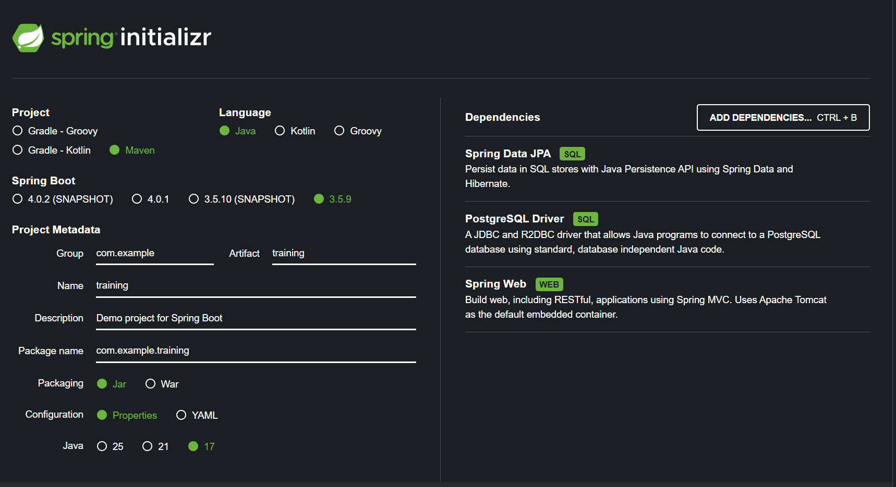

Step:
1. open https://start.spring.io/ & generate spring project

2. create all folder
3. copy resource -> application.yaml
4. start create class from dto --> entity --> repository --> service --> controller
5. try to run project

explanation:
1. controller:
   folder for class that handle API routing
2. domain:
   folder for class that object or entity need to be used
3. dto:
   folder for class that handle request and response body
4. request:
   folder for class that handle request body
5. response:
   folder for class that handle response body
6. entity:
   folder for class that represent object or entity need to be used
7. repository:
   folder for class that handle query to database
8. service:
   folder for class that handle business logic for object or entity
9. impl:
   folder for class that implement service interface
10. resource:
    folder for resource file like application.yaml
    by default spring will use application.properties. same functionality but different writting style
    in yaml or yml file, density needs to be taken into account but is easier to read than properties
    example: 
        -properties = spring,application.name=spring-boot-rest-api
        -yaml = spring:
                 application:
                     name: spring-boot-rest-api