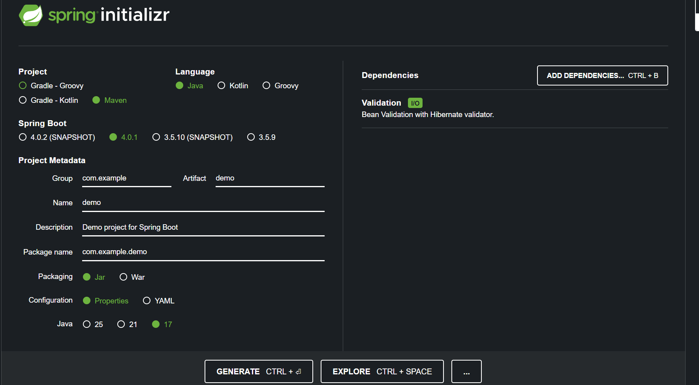
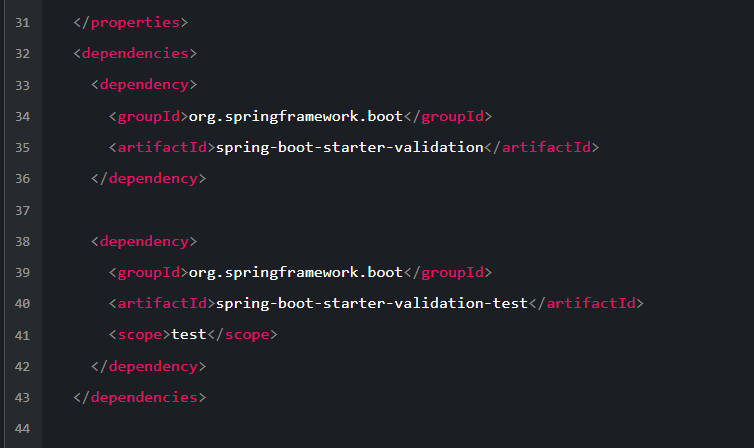

Step:
1. add BaseResponse in dto and adjust controller
2. add exception folder & class
3. implement exception in service
4. add validation dependency (go to start.spring.io search validation. click explore and copy maven)

*copy to pom.xml
5. add validation in request dto (need validation dependency)
6. adjust controller

explanation:
1. BaseResponse is a dto that contains status and message(format for client)
2. exception folder is for custom exception (specific class that already predict ex: data not found, duplicate data)
3. global exception handler is for catching all exception and return BaseResponse (it can catch all exception, just need define it). so in service we just need to throw the exception that already define before and handle it in global exception handler. ex: need to save logs or send email to dev if there is any critical bugs 
4. validation is for checking request dto (ex: not null, not blank, min, max, length, etc)
5. don't forget at @valid annotation in the controller request